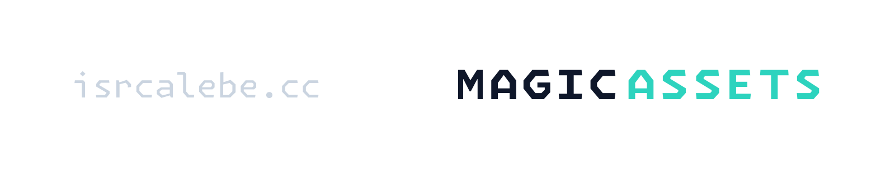

  
  

A lightweight and extensible asset management library for .NET, enabling efficient loading and organization of resources across assemblies and custom providers.

# Requirements

- A desktop platform with the [.NET 8.0 SDK](https://dotnet.microsoft.com/download) or higher runtime installed.
- When working with the codebase, we recommend using an IDE with intellisense and syntax highlighting such as [Visual Studio 2022+](https://visualstudio.microsoft.com/vs/), [JetBrains Rider](https://www.jetbrains.com/rider/), or [Visual Studio Code](https://code.visualstudio.com/) with [EditorConfig](https://marketplace.visualstudio.com/items?itemName=EditorConfig.EditorConfig) and [C#](https://marketplace.visualstudio.com/items?itemName=ms-dotnettools.csdevkit) plugin installed.

# License

This project is licensed under the [MIT License](https://opensource.org/licenses/mit). Please see [the license file](../COPYING) for more information. [tl;dr](https://www.tldrlegal.com/license/mit-license) you can do whatever you want as long as you include the original copyright and license notice in any copy of the software/source.
